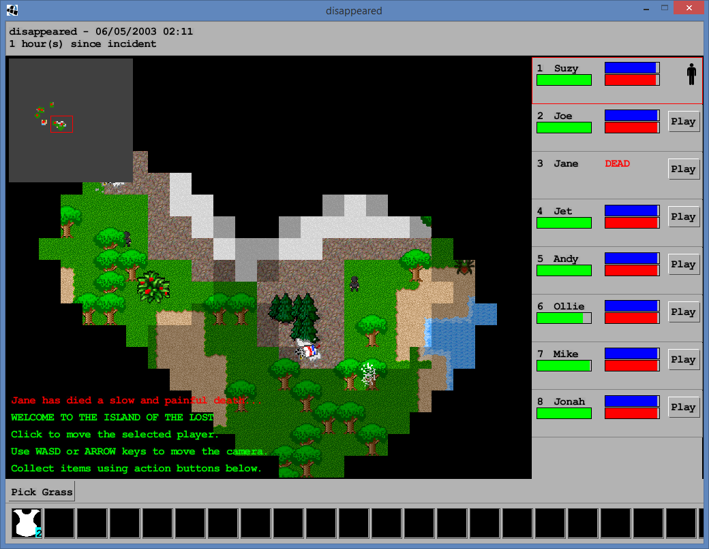

# Deserted

Created in 48 hours as part of the Global Game Jam 2015 using Slick2D. Now in process of being improved and ported to lwjgl for better performance and compatability.

## Collaborators

* adimote
* agjlewis
* mattconsto
* mikejewell
* steppers

## Building

1. Run build.xml in eclipse and wait for it to complete
2. Navigate to the dist folder and run jarsplice
3. Select NeedsASplicing.jar as the jar file, all of the files in the natives folder as natives and deserted.Game as the Main class. Then create the fat jar.
